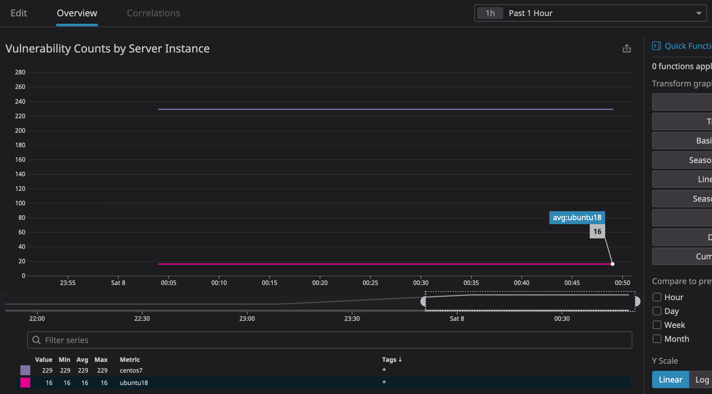

### Vulnerability Count Monitor

This project is being written in relation to ENG-10840 to plot vulnerability counts in Datadog.

#### Steps to monitor

1. Initialize and apply the `centos` and `ubuntu18` repositories with Terraform as
    ```shell script
    $ terraform init
    $ aws-vault exec <profile_id> -- terraform apply -auto-approve
    ```
2. Update `lambda-job/src/get-vulns.py` to have the correct agent IDs in `entrypoint`'s `agent_ids` dict.
3. Next, `cd` into `lambda-job`, followed by executing `build-update.sh`, which will install the Python `../requirements.txt` into `src` alongside `get-vulns.py` and zip it all together.
4. Now, we just need to create and invoke our Lambda function. Update the role ARN in `lambda-job/src/job.tf`'s `aws_lambda_function` resource definition.
5. Initialize and apply the `lambda-job` folder with Terraform in the same manner as above with `ubuntu18` and `centos`, followed by invoking your function  with
    ```shell script
    aws-vault exec <profile_id> -- aws lambda invoke --function-name publish-vulns response.json && cat response.json | jq -r
    ```
   This will output nothing but a status code block like
    ```shell script
    $ aws-vault exec support-soak -- aws lambda invoke --function-name publish-vulns response.json && cat response.json | jq -r
    {
        "StatusCode": 200,
        "ExecutedVersion": "$LATEST"
    }
    null
    ```
   if everything is configured in AWS correctly.
   
#### Plot

You may see the [graph of points over time](https://app.datadoghq.com/dashboard/h2f-sc6-hdw/alerting-dashboard?from_ts=1596257151810&fullscreen_end_ts=1596862137555&fullscreen_paused=false&fullscreen_section=overview&fullscreen_start_ts=1596858537555&fullscreen_widget=1034263581791174&live=true&to_ts=1596861951810) in our Datadog account.

